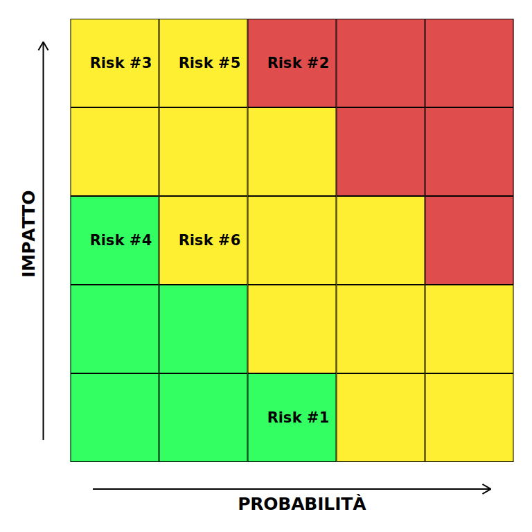

# Piano di Progetto

[TOC]

## 1. Introduzione

### 1.1 Overview del progetto

Il progetto che abbiamo intenzione di presentare, la cui realizzazione è prevista nel corso di Ingegneria del Software, svolto durante il Corso di Laurea in Informatica presso l'Università Ca' Foscari di Venezia, tenuto dal professor Agostino Cortesi, nell'a.a. 2018/2019, consiste in una **applicazione Android[^1]** atta ad interfacciarsi con un apposito robot, realizzato con **Lego Mindstorms EV3[^2]**. Il robot sarà in grado di muoversi grazie ad appositi motori e ricevere dati dal mondo esterno mediante diversi tipi di sensori.

*(scrivere nostro progetto)*

### 1.2 Deliverables del Progetto

Il progetto prevede vari elaborati da consegnare, programmati nel seguente modo per stare al passo con gli impegni previsti dal corso:

|          DELIVERABLE           |                  DESCRIZIONE                   | DATA CONSEGNA |
| :----------------------------: | :--------------------------------------------: | :-----------: |
|       Piano di progetto        |         Consegna del piano di progetto         |  16/10/2018   |
|   Documento di Analisi e SP    | Consegna del documento di analisi e specifiche |  02/11/2018   |
|        Piano di testing        |         Consegna del piano di testing          |  15/11/2018   |
|   Documentazione di progetto   |   Consegna della documentazione di progetto    |  10/12/2018   |
| Realizzazione e messa in linea | Rilascio di una versione stabile del software  |  31/01/2018   |

### 1.3 Evoluzione del progetto

Il progetto, ai fini dell'esame, é finalizzato alla consegna di un prototipo, non pronto per la produzione o l'uso commerciale. Un possibile sviluppo del progetto potrebbe essere uno sviluppo di una versione più "consumer", utilizzando hardware custom invece che Lego Mindstorms, e una applicazione con un'esperienza utente migliorata.

### 1.4 Materiale di Riferimento

- [Documentazione ufficiale sviluppo Android][developer.android.com]
- [Slide del corso di ingegneria del software 2018/2019][https://www.unive.it/data/insegnamento/89084]
- [Documentazione ufficiale lego Mindstorm EV3][https://le-www-live-s.legocdn.com/ev3/userguide/1.4.0/ev3_userguide_enus.pdf]

### 1.5 Definizione e Abbreviazioni

- [^1]: *Android*: sistema operativo dedicato agli smartphone e tablet sviluppato da Google

- [^2]: *Lego Mindstorms EV3*: Kit di sviluppo realizzato da Lego per realizzare robot, composto da vari sensori e motori da collegare ad una unità centrale (EV3), programmabile e dotata di Bluetooth e USB

- [^3]: *Agile*: insieme di metodi di sviluppo del software contrapposti al *modello a cascata* ed ad altri metodi piú tradizionali, in un approccio meno strutturato e focalizzato sull'obiettivo di consegnare al cliente, piú brevemente e frequentemente software funzionante.

- [^4]: *Github*: servizio di hosting gratuito per progetti software che utilizza il software *Git* per un *version-control* molto semplice ed intuitivo, oltre a fornire strumenti per il project management, come le *Kanban* e la *Wiki[^7]*.

- [^5]: *Issues*: su *Github[^4]* , sono un sistema per tener traccia dei vari *todos* e *open items* del progetto.

- [^6]: *Board*: su *Github[^4]* , é un sistema per categorizzare e visualizzare lo stato delle varie *Issues[^5]*.

- [^7]: *Wiki*: su *Github[^4]* , é uno strumento collaborativo per scrivere la documentazione del software.

- [^8]: *Android studio*: un ambiente di sviluppo integrato (IDE) basato sul software di *JetBrains IntelliJ IDEA* esclusivamente per la creazione di applicazioni *Android[^1]* native.

- [^9]: *Telegram*: servizio di messaggistica istantanea basato su cloud, disponibile su molte piattaforme come smartphone, desktop ed anche con un interfaccia web.

- [^10]: *Typora*: software per la creazione di documenti in *Markdown*. 

## 2. Organizzazione del Progetto

### 2.1 Modello del Processo

Per realizzare al meglio il progetto, e per la scarsa disponibiltà di incontrarsi di persona da parte dei componenti del gruppo, abbiamo pensato di adottare una metodologia di tipo **Agile[^3]**, ossia con cicli di sviluppo iterativi a durata costante.

Ogni ciclo (che chiameremo anche *sprint*) prevede una fase di planning e assessment del lavoro svolto nel precedente ciclo, mediante una riunione in presenza, seguito da una parte di analisi, sviluppo e testing. Il risultato di uno sprint è una serie di nuove funzionalità o una parte di lavoro fatta, che non corrisponde per forza con un deliverable tra quelli sopra descritti. Alla fine di uno sprint si analizza e verifica il lavoro fatto finora e si pianifica il risultato atteso dal prossimo ciclo.

### 2.2 Struttura Organizzatinva

È stata scelta una struttura organizzativa di tipo **democratica decentralizzata**. Ogni membro ha la stessa importanza nel progetto, con equa responsabilità e dovra rispettare le scadenze date. Possibili idee aggiuntive verrano valutate durante riunioni del gruppo, se ritenute fattibili ed inerenti al progetto dalla maggioranza del team la proposta verrà accettata.

### 2.3 Interfacce Organizzative

Per favorire una migliore comunicazione tra i componenti del gruppo, abbiamo deciso di utilizzare un sistema di chat online *(Telegram)*, dove potremmo prendere decisioni, organizzare le attività e gli incontri, e ci aiuteremo in caso di necessità.

Il progetto verrà reso pubblico e gestito mediante la piattaforma online fornita da *Github*, il quale ci servirà per mantenere il controllo delle versioni (rendendo non necessaria, quindi, la figura del Software Librarian), le **Issues**[^5] di progetto (che sono lavori da fare, problematiche, bugs e todo), la **Board[^6]** con le issues e la **Wiki[^7]** di progetto (dove terremo la documentazione necessaria ai vari componenti del team di progetto).

Questi due tool renderanno anche più semplice l'eventuale comunicazione con i committenti (Agostino Cortesi e Alvise Spanò) e con terze parti (eventuali tester esterni).

### 2.4 Responsabilita di progetto

Per garantire la buona riuscita del progetto, le varie responsabilità saranno suddivise in vari ruoli:

- **Project Manager**
  - <u>Responsabile:</u> Casarin Samuele
  - <u>Funzione:</u> Pianifica, coordina e supervisiona le attività del team.
- **Software Architect**
  - <u>Responsabile:</u> Zausa Giulio
  - <u>Funzione:</u> Produzione della progettazione ad alto livello, includendo standard di codifiche e meccanismi di automazione.
- **Backup engineer**
  - <u>Responsabile:</u> Baccega Sandro
  - <u>Funzione:</u> Supporta il project manager ed è responsabile della validazione.
- **Test Manager**
  - <u>Responsabile:</u> Scodeller Giovanni
  - <u>Funzione:</u> Si occupa di gestire i piani di testing, i test automatici ed è responsabile dei deliverables.
- **Techincal Staff**
  - <u>Responsabile:</u> Scodeller Giovanni, Baccega Sandro, Zausa Giulio, Casarin Samuele
  - <u>Funzione:</u> Conduce l'analisi e lo sviluppo

## 3. Processi gestionali

### 3.1 Obiettivi e Priorità

L'obiettivo è passare l'esame.

### 3.2 Assunzioni, Dipendeze, Vincoli

Fattori esterni

### 3.3 Gestione dei Rischi

|ID | Rischio | Categoria | Probabilità | Impatto |
|------------ | -------------|------------ |------------ |------------ |
|**1** | Mancanza di conoscenze | Trascurabile | 60% | Basso |
|**2** | Malattie ed infortuni | Marginale | 45% | Alto |
|**3** | Malfunzionamento Lego Mindstorm | Critico | 5% | Alto |
|**4** | Errata valutazione del carico di lavoro | Critico | 15% | Medio |
|**5** | Mancante interazione tra i membri del gruppo | Catastrofico | 20% | Alto |
|**6** | Errata valutazione della fattibiltà del progetto | Critico | 20% | Medio |

### 3.4 Meccanismo di monitoraggio e di controllo

Ogni componente del gruppo effetuerà in un primo momento un controllo personale del lavoro svolto che verrà poi revisionato insieme al resto del gruppo ove saranno esposte possibili lacune, imprecisioni e correzioni.

Ogni settimana si terrà una riunione dove si discute del lavoro svolto fino a quel punto, se il progetto è in linea con i tempi e sta proseguendo nella direzione corretta.

Il team di sviluppo ha scelto di appogiarsi a Github per lo sviluppo software e l'organizzazione dei documenti. Per un rapido scambio di informazioni e comunicazioni urgenti nel caso occorresero verrano utilizzate applicazioni di messagistica come Telegram o Whatsapp.

### 3.5 Pianificazione dello staff

Skill nescessari

## 4. Processi Tecnici

### 4.1 Metodi, strumenti e tecniche

- **Strumenti Hardware**:
- - Ogni membro del gruppo utilizzerá il proprio notebook personale (*Windows*/*Linux*/*Mac*) per lo sviluppo del progetto.
  - Ogni membro del gruppo avrá a disposizione il proprio smartphone *Android[^1]* per lo sviluppo dell'applicazione.
  - *Lego Mindstorms EV3[^2]* fornito dall'universitá.
- **Strumenti Software**
  - *Github[^4]*
  - *Android Studio[^8]*
  - *Telegram[^9]*
  - *Typora[^10]*

### 4.2 Documentazione del Software

Il progetto sará accompagnato dai seguenti documenti:

- Piano di Progetto
- Documento di Progettazione
- Documento di analisi e specifica
- Piano di Testing

### 4.3 Funzionalita al supporto del progetto

- **Pianificazione della qualita**

  Faremo molti meeting per verificare che il progetto sta seguendo le specifiche e continueremo ad aggiornare la documentazione man mano che il progetto viene sviluppato, al fine di garantire la qualitá del prodotto finale.

  Ci assicureremo inoltre di garantire che il codice segua degli standard di buona programmazione.

- **Pianificazione di gestione e configuazione**

  *Github[^4]* terrá traccia di tutte le modifiche e prototipi precedenti, il quale renderá molto semplice un eventuale *rollback* nel caso in cui qualcuno per errore modifichi del codice che era giá corretto.

## 5. Pianificazione del lavoro delle risorse umane e del budget

### 5.1 WBS

1. PIANIFICAZIONE

    1.1 Definizione degli obiettivi generali

    1.2 Definizione del piano di progetto

    ​    1.2.1 Analisi dei processi gestionali

    ​    1.2.2 Analisi dei processi tecnici

   ​     1.2.3 Pianificazione del lavoro, delle risorse umane e del budget

    1.3 Definizione del documento di analisi e specifica

2. PROGETTAZIONE

    2.1 Definizione del piano di testing

    2.2 Definizione del documento di progettazione

    ​    2.2.1 Definizione del sistema

        2.2.2 Definizione di (Lego Mindstorm)

​        2.2.3 Definizione dell'applicazione

        2.2.4 Definizione dell'interfaccia grafica​

3. REALIZZAZIONE

    3.1 Apprendimento tecnico

    3.2 Assemblaggio di (Lego Mindstorm)

    3.3 Realizzazione dell'applicazione

        3.3.1 Realizzazione dei componenti logici

        3.3.2 Realizzazione dell'interfaccia grafica

    3.4 Collaudo del sistema

4. DISPIEGAMENTO

    4.1 Realizzazione dei manuali operativi

    4.2 Consegna del sistema

5. REVISIONE

    5.1 Revisione finale

    5.2 Chiusura progetto

### 5.2 Dipendenze

| N | Attività | Durata (in ore) | Dipendenze |
|------------ | -------------|------------ | -------------|
| 1 | Defizione degli obiettivi generali | 5 | - |
| 2 | Analisi dei processi gestionali | 10 | 1 |
| 3 | Analisi dei processi tecnici | 10 | 1 |
| 4 | Pianificazione del lavoro, delle risorse umane e del budget | 10 | 1 |
| 5 | Definizione del documento di analisi e specifica | 10 | 2, 3, 4 |

### 5.3 Risorse necessarie

Stima di risorse necessarie, in termini di personale, di tempp di computazione, di hardware particolare, di supporto software

### 5.4 Allocazione del Budget e delle risorse

Associa ad ogni funzione o attivita il costo relativo

### 5.5 Pianificazione

Deadlines e Milestones

